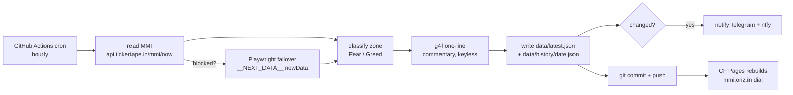

# oriz-mmi — India Market Mood Index tracker

> Hourly Tickertape Market Mood Index (MMI) fear/greed tracker + notifier, with a dark dial site.

[](LICENSE)
[](https://github.com/chirag127/oriz-mmi/stargazers)
[](https://github.com/chirag127/oriz-mmi/commits/main)
[](https://github.com/chirag127/oriz-mmi/actions/workflows/ci.yml)
[](https://www.python.org/)
[](https://astro.build/)

## What it is / why it exists

Tickertape's **Market Mood Index** is India's 0–100 fear/greed gauge — but it lives on one page and tells you nothing when you're not looking. `oriz-mmi` reads it every hour, classifies the zone, writes a one-line commentary, pushes it to Telegram + ntfy when it moves, and renders a static dial site. The repo itself is the database: every reading is committed as JSON, so history is free and versioned with zero external storage.

## Links

- **Live gauge:** [mmi.oriz.in](https://mmi.oriz.in) (canonical, Cloudflare Pages)
- **Repo:** [github.com/chirag127/oriz-mmi](https://github.com/chirag127/oriz-mmi)
- **Source data:** keyless `https://api.tickertape.in/mmi/now`

⭐ If this is useful, please **star the repo** — it helps others find it.

## How it works



## Features

- Reads Tickertape MMI from a **keyless JSON endpoint** — no scraping, no API key.
- **Playwright failover** reads the same `nowData` off the page `__NEXT_DATA__` if the API is ever blocked.
- Zone classification: `<30` Extreme Fear · `30–50` Fear · `50–70` Greed · `>70` Extreme Greed.
- **g4f (GPT4Free)** keyless one-line commentary; deterministic template fallback if every provider fails — never blocks the run.
- Notifies **Telegram** + **ntfy** on change (MMI moves intraday).
- **git-as-DB** — `data/latest.json` + `data/history/<date>.json` committed each run; free, versioned history.
- Static **Astro** dial site rebuilt on push via Cloudflare Pages.
- Self-loop (`--iterations N --interval S`) approximates sub-hourly polling inside one Actions run.

## Tech stack

- **Reader:** Python 3.11+ · `httpx` · `g4f` · optional `playwright` (failover) · `pytest`
- **Site:** Astro 6 (static, `output: 'static'`)
- **Automation:** GitHub Actions (hourly cron) · **Hosting:** Cloudflare Pages

## Repo structure

```
src/mmi_watch/
  __main__.py         # CLI entrypoint (--data --no-llm --no-notify --iterations)
  pipeline.py         # read → classify → commentary → write → notify
  models.py           # MmiReading
  sources/            # tickertape (API) + playwright failover + chain
  llm/summary.py      # g4f one-line commentary
  notify/channels.py  # Telegram + ntfy notifiers
  util.py             # logging, zone helpers
data/                 # latest.json + history/<date>.json  (git-as-DB)
web/                  # Astro dial site → mmi.oriz.in
tests/                # pytest
.github/workflows/    # ci.yml (build) + scrape.yml (hourly cron)
```

## Quick start

```bash
pip install -e ".[dev]"
python -m mmi_watch --data data --no-notify   # read + classify + commentary
pytest -q                                     # tests
cd web && npm install && npm run build        # build the site (use npm, not pnpm)
```

CLI flags: `--no-llm`, `--no-notify`, `--iterations N`, `--interval S`, `-v`.

## Configuration

All optional — the reader no-ops cleanly when unset. Values live in GitHub Actions secrets (sops+age vault), never in the repo.

| Env var | Purpose |
| --- | --- |
| `TELEGRAM_BOT_TOKEN` | Telegram bot token for notifications |
| `TELEGRAM_CHAT_ID` | Telegram chat to post to |
| `NTFY_TOPIC` | ntfy topic (enables ntfy push) |
| `NTFY_BASE_URL` | ntfy server (default `https://ntfy.sh`) |
| `NTFY_USER` | ntfy basic-auth user (optional) |
| `NTFY_PASSWORD` | ntfy basic-auth password (optional) |

## Part of the oriz family

One of ~80 [oriz](https://blog.oriz.in) sites. Read how the fleet is built solo at [blog.oriz.in](https://blog.oriz.in).

**Cost:** $0 — Cloudflare Pages free tier + GitHub Actions free minutes.

## Security

No secrets in the repo; sops+age vault. `PUBLIC_*` values (if any) are client-only. Notifications no-op when env is unset.

## Contributing

Issues and PRs welcome. Terse, conventional commits. Verify the Tickertape page/endpoint before touching the source layer.

## Status

Stable. Runs hourly in production. Roadmap: richer trend annotations, intraday sparkline on the dial.

## Changelog

Conventional commits are the changelog.

## Disclaimer

General information, not investment advice. MMI is a sentiment gauge, not a trade signal.

## License

MIT © 2026 Chirag Singhal

## Author

Chirag Singhal · chirag@oriz.in
